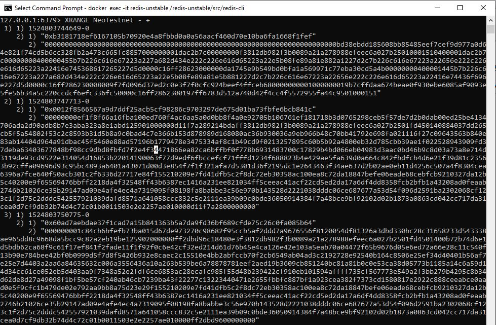

# neo-to-redis
Proof of Concept Project to copy the NEO Blockchain to Redis DB and Redis Streams API

## Purpose
This will read blocks from [neo-cli](https://github.com/neo-project/neo-cli) and write both the raw and serialized object representations of the blocks to [Redis DB and Redis Streams API](https://github.com/antirez/redis) to act as a test harness as well as allow for visualization / testing of the NEO Blockchain.

#### Redis DB

  

#### Redis Streams API

  

## Requirements
- [neo-cli](https://github.com/neo-project/neo-cli)running to provide the NEO Blockchain data.
- [redis-unstable-docker](https://github.com/gubanotorious/redis-unstable-docker) running for Redis DB and Redis Streams API.
- [Redis Desktop Manager](https://redisdesktop.com/)(Optional) is a convenient GUI to interact with your Redis DB (note: you will need to still use the redis-cli natively to access Redis Streams as of the time of writing)
