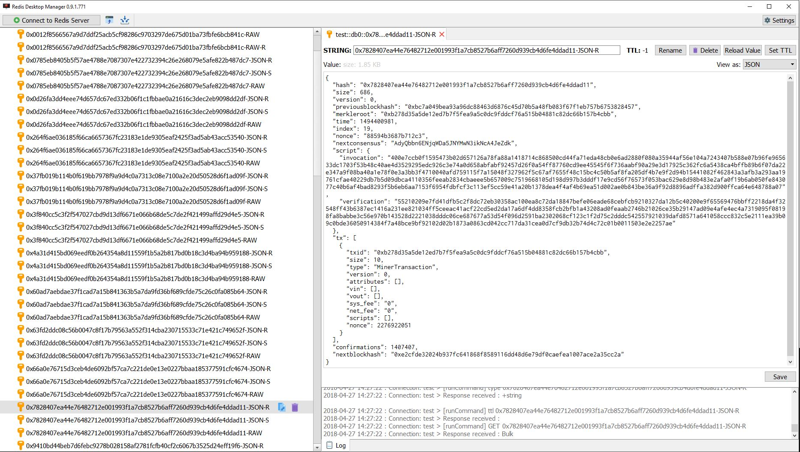

# neo-to-redis
Proof of Concept Project to copy the NEO Blockchain to Redis DB and Redis Streams API

This will read blocks from [neo-cli](https://github.com/neo-project/neo-cli) and write both the raw and serialized object representations of the blocks to [Redis DB and Redis Streams API](https://github.com/antirez/redis) to act as a test harness as well as allow for visualization / testing of the NEO Blockchain.

  

## Requirements
- [neo-cli](https://github.com/neo-project/neo-cli) needs to be running to provide the NEO Blockchain data.
- [redis-unstable-docker](https://github.com/gubanotorious/redis-unstable-docker) running to enable Redis DB and Redis Streams API Support.
